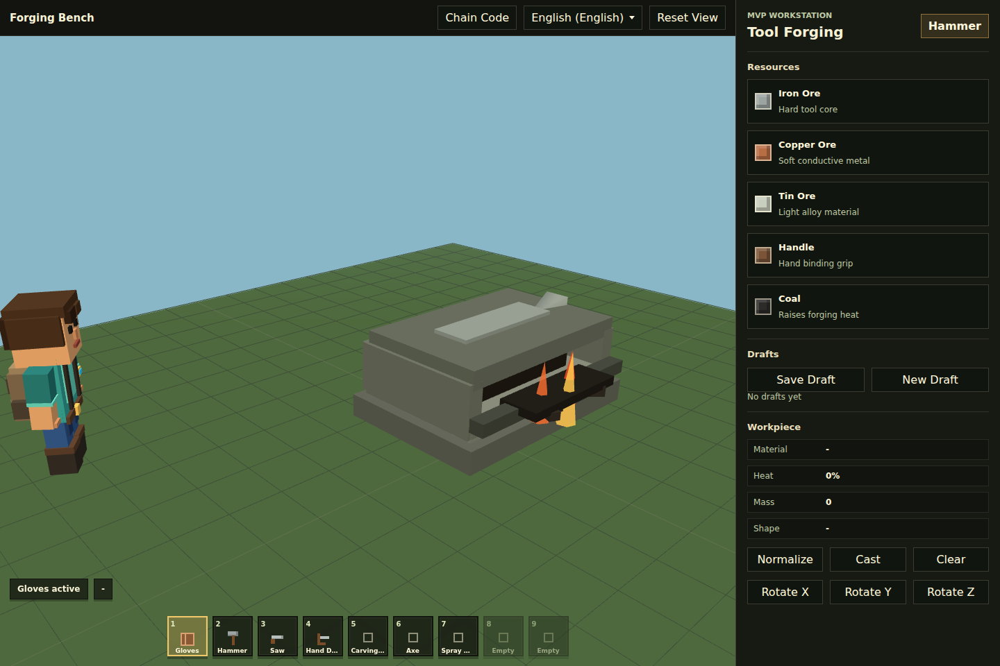
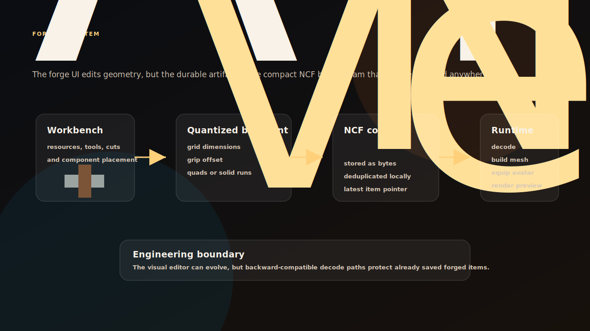
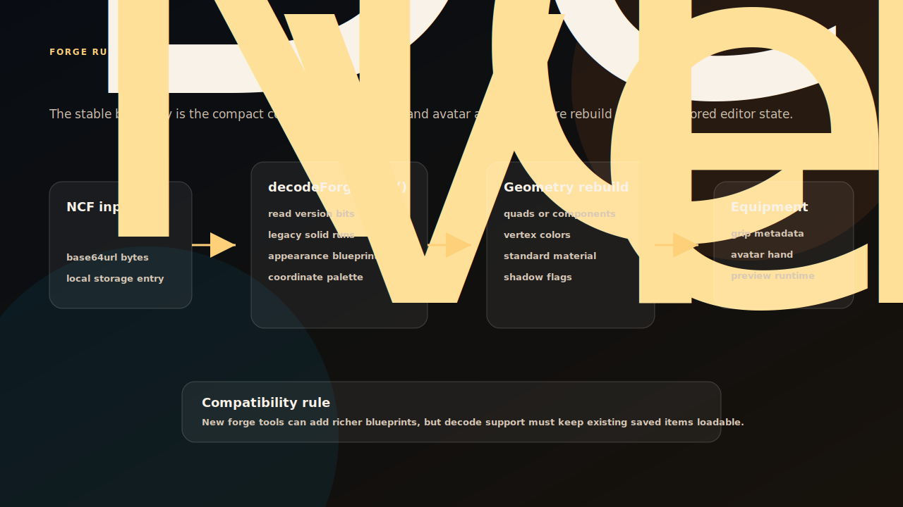

# NiceChunk Forging

Forging prototype, forged item storage logic, and avatar integration.

## Project Overview

This repository contains the forging system prototype for NiceChunk. It includes the forging page, generated item logic, avatar equipment integration, and related visual assets.

Forging is where resources and elements start becoming player-owned items. Today it is a browser-facing prototype; over time it can connect more deeply to inventory, marketplace, and on-chain asset formats.

Keeping forging separate gives the system room to mature as its own design domain.

## Portable Artifact Flow

The durable output of the forge is not the editor session. It is an `NCF1.` code that encodes a quantized blueprint. The current implementation supports older solid-run components and the newer appearance blueprint path, so saved items can continue to decode as the editor evolves.

The page is allowed to be expressive: tools, camera controls, bench geometry, drafts, and avatar preview all help find the right item feel. The code path needs to stay stricter. `decodeForgeCode()` should be the stable interpretation boundary, `createForgedItemMesh()` should rebuild visible geometry from that boundary, and avatar equipment should consume the rebuilt mesh rather than editor-only state.

This is why local storage is treated as a prototype persistence layer, not the final ownership model. It lets the team test item shape, grip, mass, and visual behavior before deciding which fields deserve protocol backing.

## Decode And Equipment Flow

The forge runtime should be judged by how well it preserves old artifacts while allowing the editor to improve. `decodeForgeCode()` is the compatibility boundary. It reads the versioned bitstream, chooses the legacy solid-run path or the newer appearance blueprint path, and returns a normalized blueprint that rendering code can rebuild into a mesh.

That split is important for player trust. A saved item should not depend on the exact editor state that created it. The item should survive as a compact code, rebuild visible geometry, expose grip metadata, and attach to the avatar runtime in a predictable way. Future chain-backed ownership should inherit that boundary instead of storing transient editor state.

## System Principles

- Item generation should be inspectable: forged output should be explainable from inputs and visible traits.
- Client prototypes should inform protocol design: browser experimentation helps identify which fields belong on-chain later.
- Avatar integration matters early: items should not exist only as data; they should be visible in the player experience.
- Storage and equipment behavior should stay easy to replace as chain-backed assets evolve.

## How It Works

- Run the forging page and inspect item generation and avatar equipment behavior.
- Use forged item helpers to understand the current browser storage model.
- Coordinate with elements and resource rules when forging inputs or outputs change.
- Avoid treating the current prototype as final settlement logic until it is connected to chain-backed assets.

## Why This Project Matters

Forging is the design path from mining to ownership. It connects exploration, resources, identity, and future commerce.

A focused repository makes it easier to test item generation ideas without destabilizing the main game client.

## Repository Layout

- `forging/`
- `src/forgedItems.js`
- `src/render/`
- `public/media/`

## Development Workflow

1. Clone the repository and inspect the focused source tree before changing shared contracts or generated artifacts.
2. Keep changes scoped to the domain of this repository. Cross-domain changes should be coordinated through the matching split repositories.
3. Run the smallest meaningful validation for the touched surface: build checks for programs, browser checks for pages, or fixture checks for deterministic libraries.
4. Update screenshots and documentation when behavior, visible UI, public constants, or developer-facing workflows change.

## Future Development Direction

- Define deterministic recipes and rarity rules.
- Integrate NCM assets as item visuals.
- Connect forged outputs to backpack and marketplace flows.
- Move durable item state to a protocol-backed model once the design is stable.

## Maintenance Notes

This repository is a focused split from the main NiceChunk working tree. Keep the public surface explicit: avoid committing private keys, wallet files, deployment-only scripts, machine-specific configuration, or generated build artifacts. Runtime user-facing copy should stay behind the i18n layer where the project has an i18n surface.
